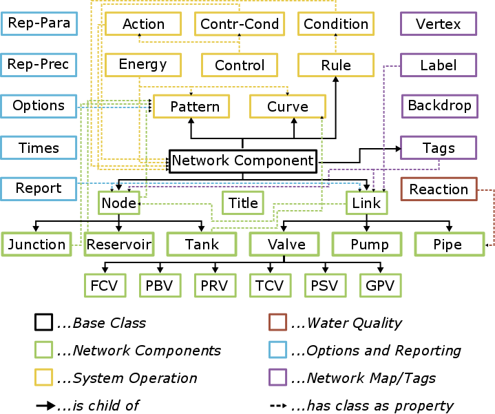

========
ELEMENTS
========

This section contains all objects in OOPNET's element package together with its properties

    Class structure of OOPNET

-------
Network
-------

.. autoclass:: oopnet.elements.network.Network
    :members:

----
Base
----

.. autoclass:: oopnet.elements.base.NetworkComponent
    :members:

------------------
Network Components
------------------
.. _node:

.. autoclass:: oopnet.elements.network_components.Node
    :members:

.. _link:

.. autoclass:: oopnet.elements.network_components.Link
    :members:

.. _junction:
	
.. autoclass:: oopnet.elements.network_components.Junction
    :members:

.. _reservoir:
	
.. autoclass:: oopnet.elements.network_components.Reservoir
    :members:

.. _tank:
	
.. autoclass:: oopnet.elements.network_components.Tank
    :members:

.. _pipe:	
	
.. autoclass:: oopnet.elements.network_components.Pipe
    :members:

.. _pump:
	
.. autoclass:: oopnet.elements.network_components.Pump
    :members:

.. _valve:
	
.. autoclass:: oopnet.elements.network_components.Valve
    :members:
	
.. autoclass:: oopnet.elements.network_components.PRV
    :members:

.. autoclass:: oopnet.elements.network_components.TCV
    :members:

.. autoclass:: oopnet.elements.network_components.PSV
    :members:

.. autoclass:: oopnet.elements.network_components.GPV
    :members:

.. autoclass:: oopnet.elements.network_components.PBV
    :members:

.. autoclass:: oopnet.elements.network_components.FCV
    :members:

-------------------
Options & Reporting
-------------------

.. autoclass:: oopnet.elements.options_and_reporting.Options
    :members:

.. autoclass:: oopnet.elements.options_and_reporting.Times
    :members:

.. autoclass:: oopnet.elements.options_and_reporting.Reportparameter
    :members:

.. autoclass:: oopnet.elements.options_and_reporting.Reportprecision
    :members:

.. autoclass:: oopnet.elements.options_and_reporting.Report
    :members:

----------------
System Operation
----------------

.. autoclass:: oopnet.elements.system_operation.Curve
    :members:

.. autoclass:: oopnet.elements.system_operation.Pattern
    :members:

.. autoclass:: oopnet.elements.system_operation.Energy
    :members:

.. autoclass:: oopnet.elements.system_operation.Condition
    :members:

.. autoclass:: oopnet.elements.system_operation.Action
    :members:

.. autoclass:: oopnet.elements.system_operation.Rule
    :members:

.. autoclass:: oopnet.elements.system_operation.Controlcondition
    :members:

.. autoclass:: oopnet.elements.system_operation.Control
    :members:

-------------
Water Quality
-------------

.. autoclass:: oopnet.elements.water_quality.Reaction

-------------------
Network: Map & Tags
-------------------

.. autoclass:: oopnet.elements.network_map_tags.Vertex
.. autoclass:: oopnet.elements.network_map_tags.Label
.. autoclass:: oopnet.elements.network_map_tags.Backdrop
.. autoclass:: oopnet.elements.network_map_tags.Tag