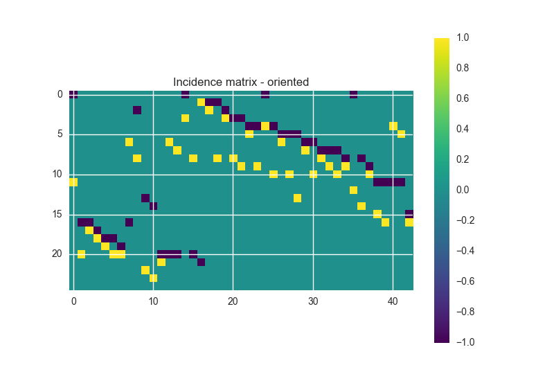
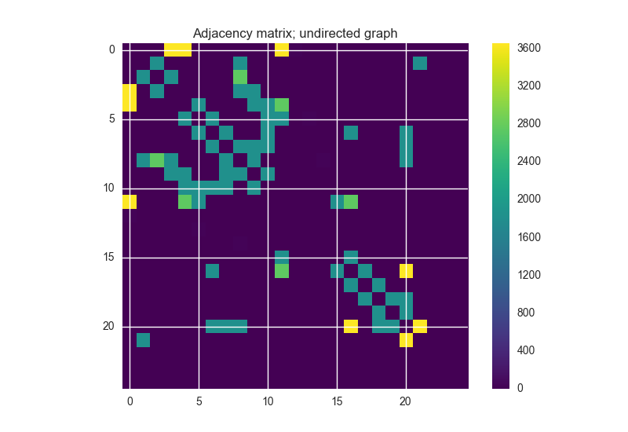

----------------------------------------------
Incidence and Adjacency Matrices
----------------------------------------------

.. note::

    Another graph theoretic example of what you can do together with OOPNET and NetworkX

In this example the computation of incidence and adjacency matrix calculations are shown

+++++++
Summary
+++++++

.. literalinclude:: /../../examples/adjacency_matrix.py

.. image:: fig/incidence_matrix_not_oriented.png

.. image:: fig/adjacency_matrix_directed.png