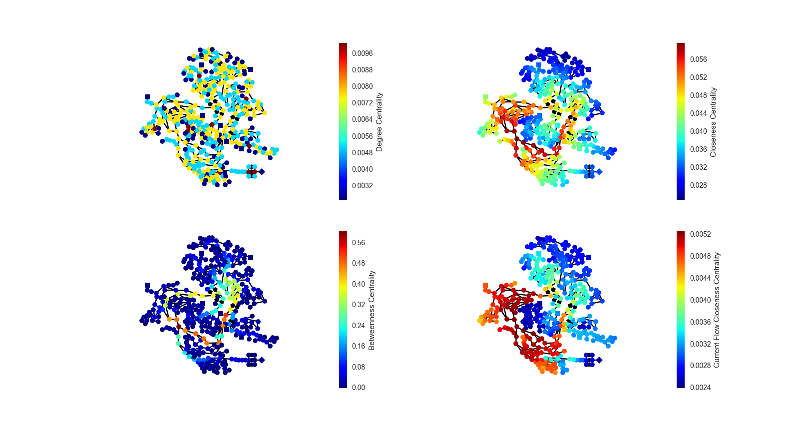
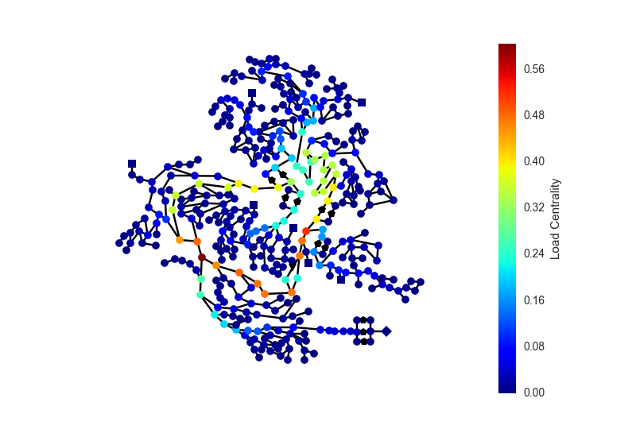

----------------------------------------------
OOPNET in the middle - Centrality calculations
----------------------------------------------

.. note::

    Another graph theoretic example of what you can do together with OOPNET and NetworkX

In this example different centrality calculations are shown.

+++++++
Summary
+++++++

.. literalinclude:: /../../examples/centrality.py

