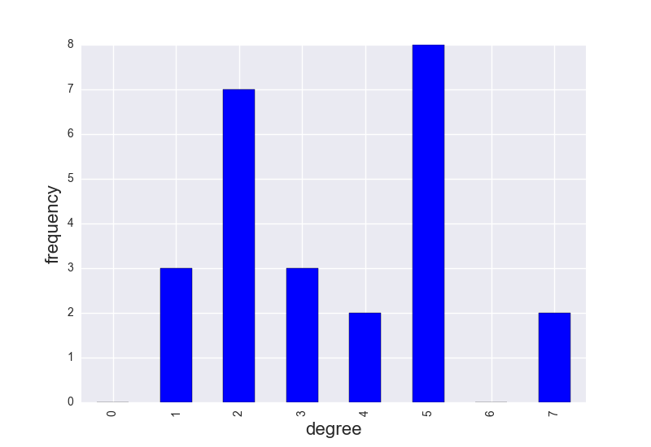

-----------
Graph Stuff
-----------

.. note::

    Graph theoretic example of what you can do together with OOPNET and NetworkX

If you load an EPANET input file into OOPNET with the `Read` function, automatically a `NetworkX` graph object is generated from the connection of the links and nodes in the Input file and stored in the `network.graph` attribute in OOPNET.

First steps load OOPNET package and Epanet inpu file into OOPNET

.. literalinclude:: /../../examples/graph_stuff.py
    :lines: 1-5

Then save the network NetworkX graph object to variable ``G`` and test if it is really a NetworkX Graph object with Python's ``type`` function

.. literalinclude:: /../../examples/graph_stuff.py
    :lines: 8-9

::

    <class 'networkx.classes.graph.Graph'>
	
And yes, it is really a NetworkX graph. What a surprise!

The package NetworkX offers various possibilities like for example calculate different graph measurements like computing the graph theoretical `Center <https://en.wikipedia.org/wiki/Graph_center>`_, `Diameter <https://en.wikipedia.org/wiki/Distance_(graph_theory)>`_ or `Radius <https://en.wikipedia.org/wiki/Distance_(graph_theory)>`_ of the graph:

.. literalinclude:: /../../examples/graph_stuff.py
    :lines: 12
	
::

    Center: ['1', '4', '13', '19', '18']

.. literalinclude:: /../../examples/graph_stuff.py
    :lines: 13

::

    Diameter: 7

.. literalinclude:: /../../examples/graph_stuff.py
    :lines: 14

::

    Radius: 4

Use Google's page rank algorithm on the network

.. literalinclude:: /../../examples/graph_stuff.py
    :lines: 17

Make a pandas series out of the results for better data handling, sort this series descending by values and give this series a name attribute, which will serve as a label for the colorbar in OOPNET's network plot.

.. literalinclude:: /../../examples/graph_stuff.py
    :lines: 18-20

First we plot the results as a barplot

.. literalinclude:: /../../examples/graph_stuff.py
    :lines: 23-24

.. image:: fig/graph_page_rank_bar.png

We can also plot the page rank series directly on the network nodes with OOPNET's Plot function

.. literalinclude:: /../../examples/graph_stuff.py
    :lines: 27

.. image:: fig/graph_page_rank_network.png

We can also calculate the degree of every node in the network and save it as a Pandas series

.. literalinclude:: /../../examples/graph_stuff.py
    :lines: 30 - 31

Of course, we can plot this again as a barplot

.. literalinclude:: /../../examples/graph_stuff.py
    :lines: 33 - 36

And we can calculate all shortest paths in the network, save the as a Pandas Dataframe and plot them as a heatmap

.. literalinclude:: /../../examples/graph_stuff.py
    :lines: 39 - 40, 43 - 44

.. image:: fig/graph_distances.png

+++++++
Summary
+++++++

.. literalinclude:: /../../examples/graph_stuff.py