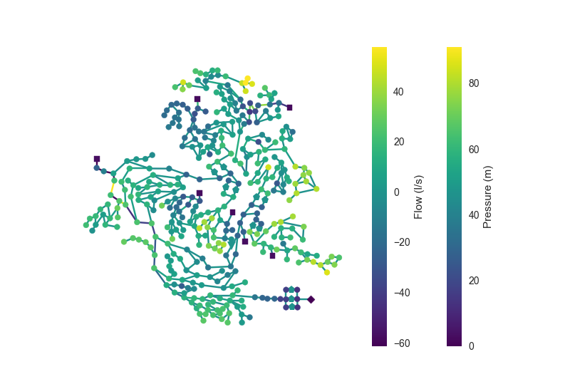

----------
Run & Plot
----------

.. note::

    This example shows you how to load an EPANET input file into OOPNET, perform a simulation and plot the results in two ways with OOPNET, on the one hand with matplotlib, on the other hand with Bokeh.

^^^^^^^^^^^^^^^^^^^^^^^^^^^^^^^^^^^^^^
`Matplotlib <http://matplotlib.org>`_
^^^^^^^^^^^^^^^^^^^^^^^^^^^^^^^^^^^^^^

The first lines are the same as in the previous example :ref:`read_and_run` (import OOPNET, define the filepath loading an EPANET Input file into OOPNET, etc ...)

.. literalinclude:: /../../examples/run_and_plot.py
    :lines: 1-6

Then one can run a simulation on the network with OOPNET's ``Run`` function and save the simulation results to the variable ``rpt`` which we have already seen before.

.. literalinclude:: /../../examples/run_and_plot.py
    :lines: 7

If we are interested in the resulting pressures and the flows, we can extract them with OOPNET's api functions ``Pressure`` and ``Flow`` from the ``rpt`` variable

.. literalinclude:: /../../examples/run_and_plot.py
    :lines: 9-10

.. :meth:`oopnet.report.report_getter_functions`

Finally, we can plot the network together with the simulation results for flow and pressure in a colored plot with OOPNET's ``Plot`` function (:meth:`oopnet.api.Plot`)

.. literalinclude:: /../../examples/run_and_plot.py
    :lines: 12
	

There is also the possibility to limit the colorbar to values between the 2nd and 98th percentile using the ``robust`` parameter. If it is set to ``True``,  the colors in the plot will be more finely graduated because the minima and maxima values will not be used for the creation of the colorbar.

.. literalinclude:: /../../examples/run_and_plot.py
	:lines: 14
	
.. image:: fig/run_and_plot_robust.png

+++++++
Summary
+++++++

.. literalinclude:: /../../examples/run_and_plot.py

^^^^^^^^^^^^^^^^^^^^^^^^^^^^^^^^^^^^^^^^^^^^^^
`Bokeh <http://bokeh.pydata.org/en/latest/>`_
^^^^^^^^^^^^^^^^^^^^^^^^^^^^^^^^^^^^^^^^^^^^^^

+++++++
Summary
+++++++

..
  bokeh-plot:: ../../examples/bokeh_run_and_plot.py