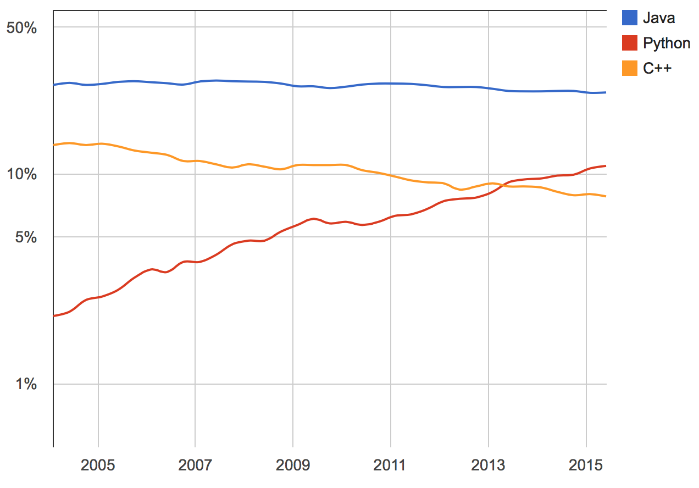
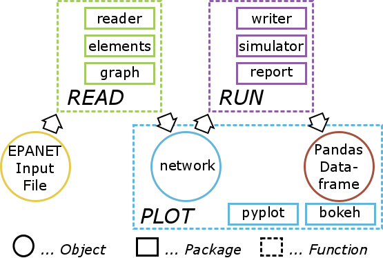
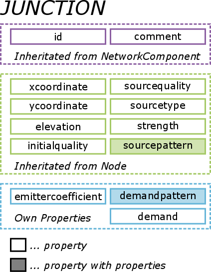

Introduction
============

Why OOPNET?
-----------

Since the WDSA2010 conference, the water related community is waiting for EPANET3.
Different attempts have been made in the past to convert EPANET into an open-source project maintained by a bigger
community instead of a single developer [2, 3].
To obtain this goal, the whole (or parts of the) software has to be rewritten in an object-oriented way, enabling
many geographically separated programmers to contribute.

So far the provided solutions were written in programming languages with a steep learning curve (e.g. C++, C#, Java).
In contrary, Python is an easy to learn open-source language with a wide range of additional packages for multiple
tasks.
In 2013, Python was the fastest growing programming language referring to the PYPL (PopularitY of Programming
Language; http://pypl.github.io/PYPL.html) index with a nowadays share of 11.3 % worldwide and still growing.
Therefore, we chose Python as programming language to rewrite EPANET to an object-oriented EPANET (OOPNET).

So far the object-oriented structure of OOPNET is similar to CWSNET [4], OOTEN [5] or PORTEAU [6] with the focus on
being as easy as possible to handle for end-users.
EPANET input files can be translated into this structure and are manipulated and simulated with EPANET’s command-line
interface through Python.
The reports are translated in Pandas [7], a python data analysis library, to enable fast and easy to use data
analysis of the results.
Parallel computation is implemented with SCOOP [8], another python library.
Additionally, optimization with genetic algorithms (GA) using the DEAP [9] library was carried out.
Plotting the water distribution network as well as the results is performed either with MatplotLib [10], a plotting
package similar to MATLAB, or directly in the user’s browser or web with Bokeh [11].

Why Python?
-----------

Python is a widely used high level programming language, with a design philosophy that emphasizes code readability
and is easy to learn compared to other programming languages with the same capabilities, like Java or C++.

The core philosophy of Python is summarized in the PEP 20 document, called the Zen of Python [12]. Here are the first
lines of this document, to get an idea of the core philosophy:

* Beautiful is better than ugly
* Explicit is better than implicit
* Simple is better than complex
* Complex is better than complicated
* Readability counts

    PYPL (PopularitY of Programming Language) Index showing the growing popularity of Python worldwide. Taken from http://pypl.github.io/PYPL.html.

Because of its simple syntax and its various applications, Python is more and more used around the whole world and the
user group is still growing (see Fig. 1), potentially replacing e.g. MATLAB, in the scientific community.

Furthermore, one of the main strengths of Python is that it has a large standard library providing tools suited to
various tasks.
This is described as its “batteries included” philosophy. By January 2015, the Python Package Index contained more
than 54.000 Python packages offering a wide range of functionality.

Program Design
--------------

The design philosophy of OOPNET consists of two main objectives, usability and collaboration.

First, the usability should be as easy as possible, enabling water engineers implementing their ideas throughout easy
readable and writeable code.
Moreover, OOPNET should warn users, if they make programming mistakes.
Mistakes, which may be hard to find later on if OOPNET is getting more complex due to further development, have to be
reported in an early stage.

Second, OOPNET is designed in a way to make collaboration possible for various geographically separated contributors.
Therefore, OOPNET consists of different packages containing modules with classes, having the object oriented design
paradigm included in its foundation.

    OOPNET pacakage structure respectively workflow of the user

The overall package structure is described in Fig. 2, which is structured to represent the workflow of a potential user.
Starting point is an EPANET Input file read in by the function Read.
The Read function makes use of the three packages reader, elements and graph. Package reader contains the functions,
which are necessary to translate arbitrary EPANET Input files in an object-oriented structure, which is implemented
in the elements package.

Moreover, the graph package translates the water distribution network in a Python NetworkX graph object [13], enabling
the application of advanced algorithms from graph theory.
The output of the Read function is an OOPNET network object, which can be manipulated by the user in a simple Python
syntax.

After the manipulation of the network by the user, the simulation of the network is started with the function Run.
Run consists of three Python packages as well, namely writer, simulator and report.
OOPNET makes use of the command line EPANET as no hydraulic solver has been implemented so far.
Therefore, from the manipulated network object a new EPANET Input file has to be generated.
This is done using the package writer.
Afterwards, command line EPANET is called with the simulator package and the results of the simulation from EPANET’s
report file are read in by the package report.
This translates the report file in a Python Pandas Dataframe [7].
Pandas is a Python data analysis library enabling the user to get all information out of the report file with an easy
to use syntax, containing fast statistical data analysis algorithms.
Furthermore, the network respectively the simulation results can be plotted by the function Plot, which contains the
packages pyplot and bokeh.
The package pyplot makes use of Python’s plotting library MatplotLib [10], which produces publication quality figures
in an easy to use syntax similar to the programming language MATLAB.
On the other hand, bokeh uses Python’s library Bokeh [11], an interactive visualization library that targets modern
web browsers for presentation.

Here is a code snippet of a simple example is presented, to make the use of OOPNET less abstract.

.. code-block:: python

    network = Read(filename)

    for p in network.pipes:
        if p.diameter > 500:
            p.roughness = 2.0

    report = Run(network)

    print Pressure(report).mean()

.. note::

    Imagine a user of OOPNET wants to change the roughness values of all pipes with a diameter greater than 500 mm to the value 2 mm. Subsequently, the user wants to analyze the mean pressure in the system for calculating e.g. the ILI (Infrastructure Leakage Index). Therefore, the network is loaded with the Read function in the first line. The next line leads to an iteration over all pipes in the system with Python’s for-loop, asking for the pipes with a diameter greater than 500 mm with the if function and setting the pipe’s roughness to the desired value of 2 mm. Subsequently, the network is simulated with the Run function and a report is generated. The last line leads to a print of the mean over all nodal pressures given in the generated report.

.. figure:: figures/Class_structure.png
    :scale: 75 %
    :align: center

    Class structure of OOPNET implemented in the elements package

The object-oriented structure implemented in the elements package is represented in Fig. 4, which shows the
object-oriented design paradigm with inheritance of classes and properties.
Inheritance is depicted as a black arrow, e.g. the class Junction is a child of class Node, which is again the child
of the class Network Component.
Underlying all classes is an abstract ``HasStrictTraits`` class from the Python package ``Traits`` [14].
Traits circumvents the drawback of Python that all class objects and all class properties can be overwritten at
runtime of the program.
Furthermore, Traits enables fixed types of properties in Python.
For example, the roughness coefficient of a pipe always has to be a floating point number and not a string.
If the user accidentally defines the roughness of a pipe as a string, this will lead to an error and the user will be
led to the wrong line in the code.
This prevents from the aforementioned propagation of errors in larger, more complex programs, which would be hard to
find in a later stage of programming

Additionally, Fig. 4 shows, that if a class has another class as one of its properties, it is depicted as dotted arrow.
For example, a Link has always a start-node and an end-node.
Therefore the Link class has an instance of the class Node as one of its properties.

The elements package is subdivided in several Python modules, to guarantee a higher level of modularity in the code.
This increases the possibility of collaboration for more programmers, since the programmers are able to work on
different files.
The files are named according to the EPANET manual Input file structure [1] (Network Components, System Operation,
Water Quality, ...) and are shown in different colors in Fig. 4.
This structure assists collaborators, which are new to OOPNET but used to EPANET, to quickly get familiar with
OOPNET.
In addition, the reader and writer packages are structured in a similar way.

    Properties of OOPNET's Junction class

In Fig. 5 the properties of the Junction class as an example for the property structure of all the other classes in
OOPNET is shown.
Only the properties emittercoefficient, demandpattern and demand are defined in the Junction class whereas all other
properties are inherited from the Node or the Network Component class.
Also the properties sourcepattern and demandpattern are stressed out in Fig. 5, since they refer to another instance
of a class, namely Pattern, which has again properties.

.. figure:: figures/Network_Structure.png
    :scale: 75 %
    :align: center

    Properties of the Network class object conataining all the information from an EPANET Input file

On top of the elements class structure is the network object, which is again a class with properties consisting of
Python lists of the classes of elements, describing the whole network and its physical properties respectively the
simulation parameters (Fig. 6).
Additionally, the graph property contains the NetworkX graph object and networkhash is a property containing a Python
dictionary linking all id’s of the elements of the network to their memory location, allowing faster connection of
the elements respectively faster searching through the network’s elements.
An example of a bokeh plot of a network and its simulation results is shown in Fig. 7. The node pressures and the
pipe flows are depicted in different colors.
On top of the figure the bokeh’s menu with different tools, like panning, zooming, refreshing or exporting, can be seen.

..
    bokeh-plot:: bokeh_run_and_plot.py
