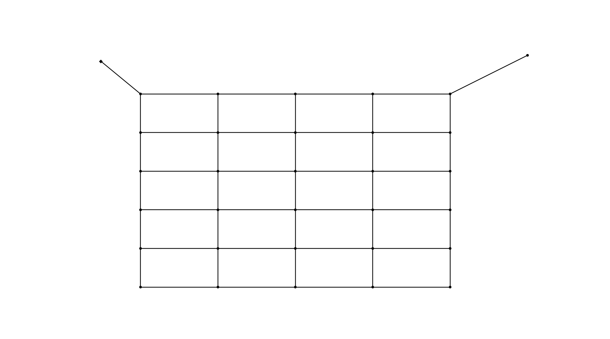

-------------------
Adders and Removers
-------------------

This example shows how to add network components like junctions, pipes or pumps to a network and remove them again.

.. note::

    There are adding and removing functions for every network component type (pipes, junctions, valves, tanks, ...). In
    this example only some of these functions are shown, the remaining functions however all work the same way.

First, we have to import the required packages:

- :mod:`os` is used for declaring the path to the file
- :mod:`matplotlib.pyplot` is imported for controlling the plot's created in this example
- :mod:`oopnet` is imported as well

.. literalinclude:: /../examples/adders_and_removers.py
    :language: python
    :lines: 1-4

For this example the Poulakis network is used. The network is therefore read from the EPANET input file.

.. literalinclude:: /../examples/adders_and_removers.py
    :language: python
    :lines: 6-7

.. image:: figures/examples/adders_and_removers_1.png

To add a new pipe, first a new junction has to be added to the network. Here a new junction is added in the top right
corner of the network. The new junction is given an ID, coordinates and a demand. Other values like ``elevation`` could
also be set but in this example the default values are being used for all other parameters.

.. literalinclude:: /../examples/adders_and_removers.py
    :language: python
    :lines: 9

Now, a new pipe is added to connect the new junction to the network. Again, some default values for the parameters are
used, some parameters are set manually.

.. literalinclude:: /../examples/adders_and_removers.py
    :language: python
    :lines: 10-11

Next, all pipes connected to junction ``J-24`` and then the junction itself are removed from the network. For this, we
first get the node object representing the junction and then look for all links connected to the junction by calling
:func:`oopnet.get_adjacent_links()`. Using the :func:`oopnet.remove_junction()` utility function, we then remove the neighbor links and the
junction.

.. literalinclude:: /../examples/adders_and_removers.py
    :language: python
    :lines: 13-19

After that, a single pipe is added in the area where the other pipes have just been removed.

.. literalinclude:: /../examples/adders_and_removers.py
    :language: python
    :lines: 21-22

.. image:: figures/examples/adders_and_removers_3.png

Now, a new reservoir is added to the network and a pump is used to connect it to a nearby junction.

.. literalinclude:: /../examples/adders_and_removers.py
    :language: python
    :lines: 23-24

.. image:: figures/examples/adders_and_removers_4.png

+++++++
Summary
+++++++

.. literalinclude:: /../examples/adders_and_removers.py
    :language: python
