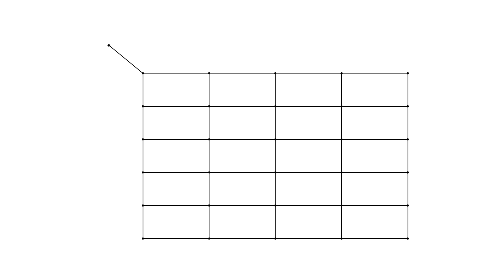

-------------------
Adders and Removers
-------------------

This example shows how to add network components like junctions, pipes or pumps to a network and remove them again.

.. note::

    There are adding and removing functions for every network component type (pipes, junctions, valves, tanks, ...). In this example only some of these functions are shown, the remaining functions however all work in the same way.

For the addition and removal of network components only OOPNET has to be imported. The os package is used for declaring the path to the file while NetworkX is only used as a helpful package for later.

.. literalinclude:: /../examples/adders_and_removers.py
    :language: python
    :lines: 1-5

For this example the Poulakis network is used. The network is therefore read from the EPANET input file.

.. literalinclude:: /../examples/adders_and_removers.py
    :language: python
    :lines: 8

To add a new pipe, first a new junction has to be added to the network. Here a new junction is added in the top right corner of the network. The new junction is given an ID, coordinates and a demand. Other values like elevation could also be set but in this example the default values are being used for the other parameters.

.. literalinclude:: /../examples/adders_and_removers.py
    :language: python
    :lines: 10

Now, a new pipe is added to connect the new junction to the network. Again some default values for the parameters are used, some parameters are set manually.

.. literalinclude:: /../examples/adders_and_removers.py
    :language: python
    :lines: 12

.. image:: figures/examples/adders_and_removers_2.png

Next all pipes connected to the junction ``J-24`` and then the junction itself are removed from the network. First, a MultiGraph is created from the network, then NetworkX is employed to find all neighbours of ``J-24``.

.. literalinclude:: /../examples/adders_and_removers.py
    :language: python
    :lines: 15-22

After that a single pipe is added in the area where the other pipes have just been removed.

.. literalinclude:: /../examples/adders_and_removers.py
    :language: python
    :lines: 24-25

.. image:: figures/examples/adders_and_removers_3.png

Finally, a new reservoir is added to the network and a pump is used to connect it to a nearby junction.

.. literalinclude:: /../examples/adders_and_removers.py
    :language: python
    :lines: 27-30

+++++++
Summary
+++++++

.. literalinclude:: /../examples/adders_and_removers.py
    :language: python
