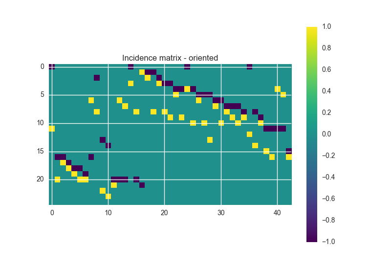
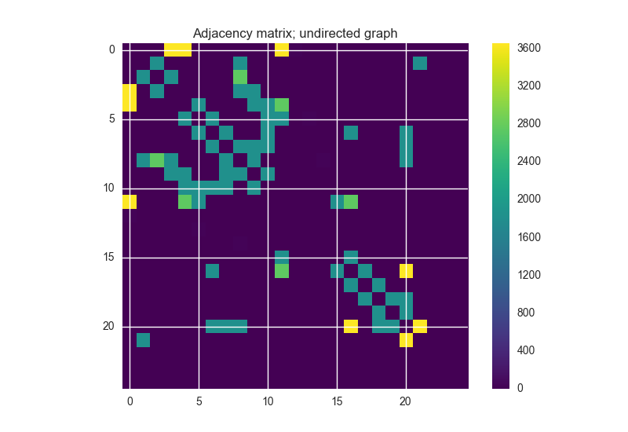
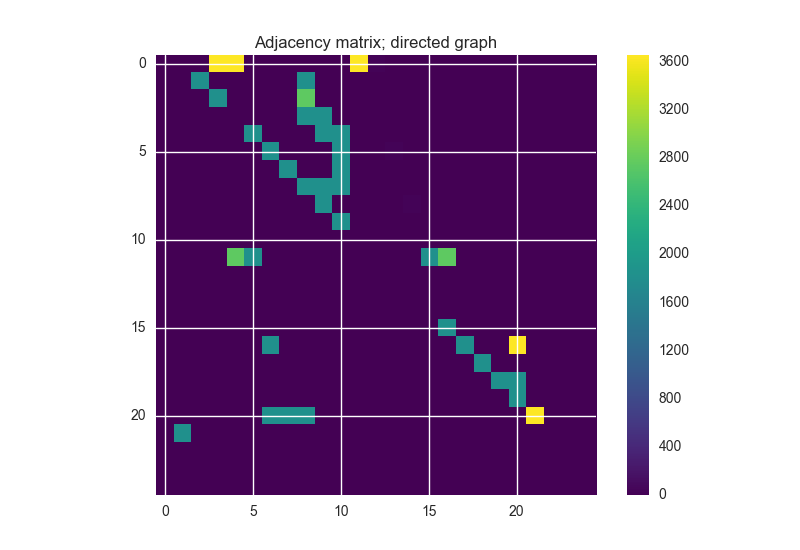

----------------------------------------------
Incidence and Adjacency Matrices
----------------------------------------------

In this example, we take a look at calculation of incidence and adjacency matrices with OOPNET and NetworkX.

We first have to import the required packages:

- :mod:`os` is used for specifying the path to the EPANET input file
- :mod:`networkx` is responsible for the calculation of the matrices
- :mod:`matplotlib.pyplot` plots the matrices
- :mod:`oopnet` provides the means to use EPANET models for the matrix calculations

.. literalinclude:: /../examples/adjacency_matrix.py
    :language: python
    :lines: 1-5

We are using the "Anytown" model in this example. We specify the path to the model and read it:

.. literalinclude:: /../examples/adjacency_matrix.py
    :language: python
    :lines: 7-8

Next, we create a :class:`networkx.Graph` object from our network by using the :class:`oopnet.Graph` factory, get a list of all node IDs and convert the link objects in the model
to ``networkx`` links:

.. literalinclude:: /../examples/adjacency_matrix.py
    :language: python
    :lines: 10-12

We can now calculate the incidence matrix for our network and show it in the console:

.. literalinclude:: /../examples/adjacency_matrix.py
    :language: python
    :lines: 14-16

Next, we use the ``oriented`` argument to get the oriented incidence matrix:

.. literalinclude:: /../examples/adjacency_matrix.py
    :language: python
    :lines: 18-20

Getting the adjacency matrix works very similar:

.. literalinclude:: /../examples/adjacency_matrix.py
    :language: python
    :lines: 23-25

We can not only create a simple :class:`networkx.Graph` object from our network, we can also create :class:`networkx.DiGraph`,
:class:`networkx.MultiGraph` and :class:`networkx.MultiDiGraph` objects. OOPNET provides factories for all of these graph
types (:class:`oopnet.Graph`, :class:`oopnet.DiGraph`, :class:`oopnet.MultiGraph` and :class:`oopnet.MultiDiGraph`).
Here, we create a new :class:`networkx.DiGraph` and calculate the adjacency matrix:

.. literalinclude:: /../examples/adjacency_matrix.py
    :language: python
    :lines: 27-30

Finally, we can use Matplotlib to plot the different matrices:

.. literalinclude:: /../examples/adjacency_matrix.py
    :language: python
    :lines: 32-35

.. image:: figures/examples/incidence_matrix_not_oriented.png

.. literalinclude:: /../examples/adjacency_matrix.py
    :language: python
    :lines: 37-40

.. literalinclude:: /../examples/adjacency_matrix.py
    :language: python
    :lines: 42-45

.. literalinclude:: /../examples/adjacency_matrix.py
    :language: python
    :lines: 47-50

Use :func:`plt.show` to show the plots:

.. literalinclude:: /../examples/adjacency_matrix.py
    :language: python
    :lines: 52

+++++++
Summary
+++++++

.. literalinclude:: /../examples/adjacency_matrix.py
    :language: python
