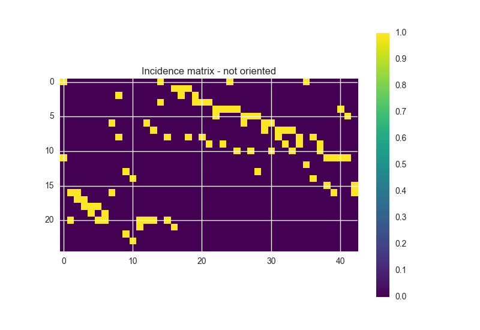

----------------------------------------------
Incidence and Adjacency Matrices
----------------------------------------------

.. note::

    Another graph theoretic example of what you can do together with OOPNET and NetworkX

In this example the computation of incidence and adjacency matrix calculations are shown

+++++++
Summary
+++++++

.. literalinclude:: /../examples/adjacency_matrix.py
    :language: python

.. image:: figures/examples/incidence_matrix_oriented.png

.. image:: figures/examples/adjacency_matrix_undirected.png

.. image:: figures/examples/adjacency_matrix_directed.png