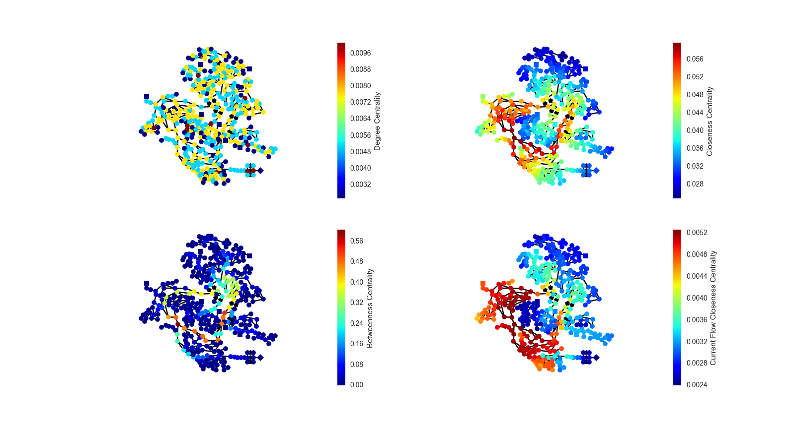
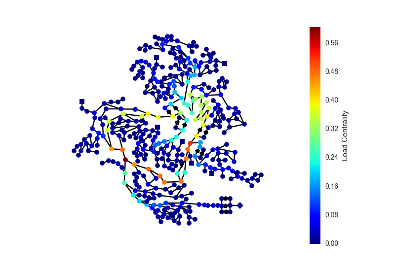

----------------------------------------------
OOPNET in the middle - Centrality calculations
----------------------------------------------

Another graph theoretic example of what you can do together with OOPNET and NetworkX.

In this example, different centrality calculations are shown. NetworkX is again used for the matrix calculations.

First, the necessary packages are imported, a filename is declared and an OOPNET :class:`oopnet.Network` is created from the EPANET input file.

.. literalinclude:: /../examples/centrality.py
	:language: python
	:lines: 1-10

Then a :class:`networkx.MultiGraph` is created based on the Network.

.. literalinclude:: /../examples/centrality.py
	:language: python
	:lines: 12

Next, a Matplotlib figure is instantiated. This object will hold a subplot for all of the four centralities we will calculate:

.. literalinclude:: /../examples/centrality.py
	:language: python
	:lines: 14

Now, the metrics are calculated. We pass the previously created :class:`networkx.MultiGraph` to different NetworkX functions to calculate the metrics.
Since we want to plot the centrality values per node, we need a pandas Series to pass it to the OOPNET :meth:`oopnet.Network.plot()` method.
We change the series' names so that it is correctly shown in the plot. Then, we create Matplotlib axes objects and plot
the network with these axes objects.

.. literalinclude:: /../examples/centrality.py
	:language: python
	:lines: 16-38

To create a single plot for a centrality, just omit the axes object creation and don't pass one to the plotting function:

.. literalinclude:: /../examples/centrality.py
	:language: python
	:lines: 40-43

Finally, show the plots:

.. literalinclude:: /../examples/centrality.py
	:language: python
	:lines: 45

+++++++
Summary
+++++++

.. literalinclude:: /../examples/centrality.py
	:language: python

