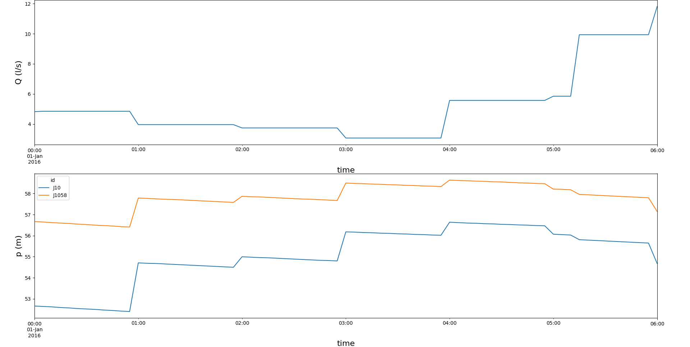

--------------------------------------------------------
Time machine - Extended period simulations with OOPNET
--------------------------------------------------------

In this example we will discuss performing extended period simulations with OOPNET.

As always, we have to import all required packages. This time, we will also need :class:`datetime.timedelta` to specify
some time related settings in the model.

.. literalinclude:: /../examples/extended_period.py
	:language: python
	:lines: 1-5

Next, we read the "C-Town" model:

.. literalinclude:: /../examples/extended_period.py
	:language: python
	:lines: 7-8

Now, we change the simulation duration to 6 hours and the reporting time step to 5 minutes. For this, we use
:class:`datetime.timedelta`:

.. literalinclude:: /../examples/extended_period.py
	:language: python
	:lines: 10-11

Wen can now simulate the model and interact with the :class:`oopnet.SimulationReport`. When we access a specific property of
this report, we now get a :class:`pandas.DataFrame` object instead of a :class:`pandas.Series` like we get when doing
steady-state simulations:

.. literalinclude:: /../examples/extended_period.py
	:language: python
	:lines: 13-14

::

    id                         J511   J411   J414  ...    T5    T2    T4
    time                                           ...
    2016-01-01 00:00:00       28.83  64.42  39.00  ...  2.25  2.95  2.35
    2016-01-01 00:05:00       28.71  64.40  38.97  ...  2.20  2.95  2.23
    2016-01-01 00:10:00       28.59  64.37  38.95  ...  2.15  2.95  2.12
    2016-01-01 00:15:00       28.48  64.35  38.93  ...  2.10  2.95  2.00
    2016-01-01 00:20:00       28.36  64.32  38.90  ...  2.05  2.95  1.88
    ...                         ...    ...    ...  ...   ...   ...   ...
    2016-01-01 05:40:00 -7520000.00  63.65  38.24  ... -0.00  2.31 -0.00
    2016-01-01 05:45:00 -7530000.00  63.63  38.22  ... -0.00  2.30 -0.00
    2016-01-01 05:50:00 -7530000.00  63.62  38.20  ... -0.00  2.29 -0.00
    2016-01-01 05:55:00 -7530000.00  63.60  38.18  ... -0.00  2.28 -0.00
    2016-01-01 06:00:00 -9960000.00  63.29  37.88  ... -0.00  2.27 -0.00

    [73 rows x 396 columns]

Using pandas, we can also get some basic statistics:

.. literalinclude:: /../examples/extended_period.py
	:language: python
	:lines: 15

::

    id             J511       J411       J414  ...         T5         T2         T4
    count  7.300000e+01  73.000000  73.000000  ...  73.000000  73.000000  73.000000
    mean  -5.704922e+06  64.220137  38.803562  ...   0.863288   2.698767   0.359315
    std    4.155719e+06   0.268388   0.266418  ...   0.696533   0.237843   0.659588
    min   -1.090000e+07  63.290000  37.880000  ...  -0.000000   2.270000  -0.000000
    25%   -8.130000e+06  64.170000  38.760000  ...   0.240000   2.490000   0.000000
    50%   -7.530000e+06  64.300000  38.880000  ...   0.730000   2.720000   0.000000
    75%    2.732000e+01  64.390000  38.970000  ...   1.420000   2.950000   0.430000
    max    2.883000e+01  64.560000  39.150000  ...   2.250000   2.950000   2.350000

    [8 rows x 396 columns]

Now, we want to create a plot using this data. In the plot, we want to show the flow through pipe `P1000` on one
subplot, while showing the pressure at junctions `J10` and `J1058` on a second subplot. For this, we first have to
create a new matplotlib :class:`matplotlib.Figure`.

.. literalinclude:: /../examples/extended_period.py
	:language: python
	:lines: 17

We then create an :class:`matplotlib.Axes` object for the first plot, plot the data, set labels for the axes and add a legend.

.. literalinclude:: /../examples/extended_period.py
	:language: python
	:lines: 13-15

Next, we do the same with the pressure data. Note, that we don't have to create a legend because pandas does it
automatically when plotting several lines.

.. literalinclude:: /../examples/extended_period.py
	:language: python
	:lines: 25-28

Finally, we can show our plots:

.. literalinclude:: /../examples/extended_period.py
	:language: python
	:lines: 30

+++++++
Summary
+++++++

.. literalinclude:: /../examples/extended_period.py
	:language: python