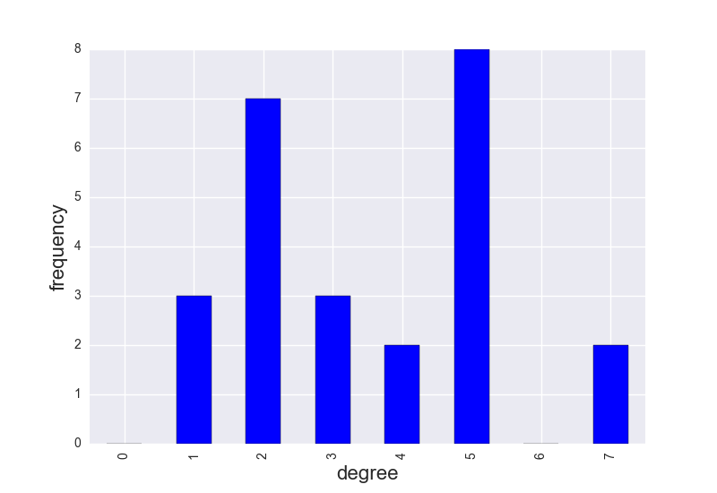

-----------
Graph Stuff
-----------

A graph theoretic example of what you can do together with OOPNET and NetworkX.

As always, we first specify our imports. In this example, we will use :mod:`networkx` for calculating graph metrics,
:mod:`matplotlib.pyplot` and :mod:`seaborn` for plotting, :mod:`pandas` for some shortcuts with our data and, of course,  :mod:`oopnet`.

.. literalinclude:: /../examples/graph_stuff.py
	:language: python
	:lines: 1-7

We now load the "Anytown" model and create a :class:`networkx.MultiGraph` object from the model.

.. warning::
    You can also create :class:`networkx.Graph`, :class:`networkx.DiGraph` or :class:`networkx.MultiDiGraph` objects from
    a network but keep in mind, that :class:`networkx.Graph` and :class:`networkx.DiGraph` objects have a limitation:
    They only keep one connection between two nodes. If you have several pipes connecting two nodes, only one of the will
    be kept. OOPNET warns you, if you create a :class:`networkx.Graph` or :class:`networkx.DiGraph` object.

.. literalinclude:: /../examples/graph_stuff.py
	:language: python
	:lines: 12

The package NetworkX offers various possibilities regarding graph theoretical algorithms, matrices etc. Here, we
calculate different graph measurements like computing the graph theoretical `Center <https://en.wikipedia.org/wiki/Graph_center>`_, `Diameter <https://en.wikipedia.org/wiki/Distance_(graph_theory)>`_ or `Radius <https://en.wikipedia.org/wiki/Distance_(graph_theory)>`_ of the graph:

.. literalinclude:: /../examples/graph_stuff.py
	:language: python
	:lines: 14
	
::

	Center: ['1', '4', '13', '19', '18']

.. literalinclude:: /../examples/graph_stuff.py
	:language: python
	:lines: 15

::

	Diameter: 7

.. literalinclude:: /../examples/graph_stuff.py
	:language: python
	:lines: 16

::

	Radius: 4

Next, we apply Google's page rank algorithm on the network:

.. literalinclude:: /../examples/graph_stuff.py
	:language: python
	:lines: 18

We create a :class:`pandas.Series` out of the results for better data handling, sort this series in descending order and give this series a name attribute, which will serve as a label for the color bar in OOPNET's network plot.

.. literalinclude:: /../examples/graph_stuff.py
	:language: python
	:lines: 19-21

First, we plot the results as a bar plot:

.. literalinclude:: /../examples/graph_stuff.py
	:language: python
	:lines: 23-24

.. image:: figures/examples/graph_page_rank_bar.png

We can also plot the page rank series directly on the network nodes with OOPNET's plot function:

.. literalinclude:: /../examples/graph_stuff.py
	:language: python
	:lines: 26

.. image:: figures/examples/graph_page_rank_network.png

We can calculate the degree of every node in the network and save it as a :class:`pandas.Series`:

.. literalinclude:: /../examples/graph_stuff.py
	:language: python
	:lines: 28-29

Of course, we can plot this again as a bar plot

.. literalinclude:: /../examples/graph_stuff.py
	:language: python
	:lines: 31-34

And we can calculate all shortest paths in the network, save them as a :class:`pandas.DataFrame` and plot them as a heatmap.
Here, we use :mod:`seaborn`, a library based on matplotlib that creates nice heatmaps.

.. literalinclude:: /../examples/graph_stuff.py
	:language: python
	:lines: 31-36, 38-40

.. image:: figures/examples/graph_distances.png

+++++++
Summary
+++++++

.. literalinclude:: /../examples/graph_stuff.py
	:language: python