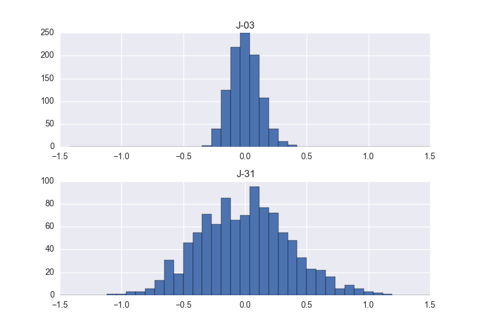

--------------------
MC, make some noise!
--------------------

Example of a simple Monte Carlo simulation with OOPNET

+++++++
Summary
+++++++

.. literalinclude:: /../examples/mc_make_some_noise.py
	:language: python

All simulations
::

    id       J-02      J-03      J-04      J-05      J-06      J-07      J-08  \
    0    48.05263  36.20626  32.09023  25.57547  22.36982  16.98668  33.86014
    1    48.05536  36.16504  32.02279  25.50081  22.22193  16.79289  33.85170
    2    48.07595  36.27081  32.13451  25.59465  22.37663  16.98995  33.95707
    3    48.03927  36.10299  31.94703  25.32881  22.07879  16.63252  33.78149
    4    48.06370  36.20726  32.07417  25.50348  22.25249  16.83488  33.88490
    5    48.04335  36.11147  31.94106  25.32247  22.05440  16.66107  33.78643
    6    48.06145  36.20734  32.05158  25.44507  22.11934  16.55697  33.89405
    7    48.06710  36.23970  32.10273  25.54541  22.28316  16.94171  33.92965
    8    48.07666  36.26645  32.13058  25.60568  22.37519  16.91885  33.97862
    9    48.10617  36.38207  32.28330  25.78794  22.53194  17.20967  34.08455
    10   48.07971  36.27354  32.13645  25.55922  22.32138  17.01659  33.95674
    11   48.06863  36.24666  32.11699  25.57224  22.33344  16.91153  33.91496
    12   48.10598  36.39598  32.32642  25.85967  22.66669  17.25910  34.09404
    13   48.03654  36.09021  31.90990  25.30857  22.02899  16.54935  33.74682
    14   48.12745  36.48903  32.45071  26.06793  22.92767  17.58916  34.21410
    15   48.08218  36.28799  32.15750  25.62647  22.42363  17.05583  33.97613
    16   48.08147  36.29768  32.19301  25.70372  22.44553  17.05880  33.96402
    17   48.11480  36.40691  32.30753  25.82820  22.59041  17.17222  34.12262
    18   48.07418  36.28747  32.16848  25.64538  22.41353  17.03652  33.95995
    19   48.07574  36.25684  32.11346  25.55870  22.28025  16.78620  33.96915
    20   48.09552  36.35032  32.23259  25.78288  22.61438  17.29116  34.03664
    21   48.09579  36.33810  32.24323  25.77134  22.53391  17.18315  34.02614
    22   48.05028  36.14321  31.97496  25.38715  22.10423  16.60662  33.83548
    23   48.06408  36.19558  32.06313  25.54452  22.32975  16.98651  33.89101
    24   48.09536  36.35620  32.26151  25.79544  22.56889  17.35523  34.05053
    25   48.05047  36.13840  31.98923  25.41736  22.17638  16.76101  33.80855
    26   48.08620  36.29636  32.19616  25.68926  22.46867  17.09886  33.99624
    27   48.04121  36.13400  31.97240  25.35273  22.07393  16.68850  33.76446
    28   48.06730  36.19647  32.04176  25.49324  22.24962  16.69672  33.87530
    29   48.02549  36.06430  31.88877  25.26326  22.05229  16.67207  33.70544
    ..        ...       ...       ...       ...       ...       ...       ...
    970  48.07579  36.23956  32.11909  25.57333  22.32073  16.75916  33.90469
    971  48.07568  36.24693  32.09726  25.54302  22.28023  16.90422  33.94631
    972  48.06403  36.21048  32.05608  25.51338  22.25726  16.85144  33.92192
    973  48.06808  36.21251  32.08449  25.49238  22.20456  16.84911  33.89600
    974  48.05397  36.16566  32.02773  25.45019  22.21239  16.94181  33.82619
    975  48.06212  36.21580  32.06981  25.51364  22.24534  16.79800  33.90304
    976  48.07601  36.27822  32.17314  25.69534  22.48069  17.17877  33.93767
    977  48.10380  36.39755  32.31929  25.88289  22.68892  17.31169  34.11094
    978  48.11771  36.45352  32.37920  25.97898  22.79887  17.42808  34.19733
    979  48.12217  36.43320  32.35101  25.90001  22.69481  17.38090  34.13457
    980  48.11197  36.37006  32.23886  25.71607  22.46581  17.04320  34.07144
    981  48.02599  36.05515  31.86634  25.20280  21.90401  16.40769  33.70277
    982  48.07099  36.23217  32.10479  25.61222  22.43352  17.06845  33.91563
    983  48.02738  36.10115  31.96286  25.37524  22.13148  16.67139  33.72991
    984  48.09159  36.32709  32.21476  25.70711  22.45411  16.97367  34.03801
    985  48.09814  36.35109  32.26931  25.80882  22.59034  17.26244  34.05997
    986  48.03797  36.11663  31.95249  25.39286  22.14025  16.67498  33.77147
    987  48.01366  36.02291  31.85334  25.22548  21.95377  16.58075  33.62440
    988  48.06314  36.19137  32.05089  25.52244  22.27832  16.92956  33.85867
    989  48.05946  36.19695  32.05098  25.49600  22.22557  16.70917  33.88520
    990  48.06960  36.21960  32.09010  25.56104  22.32839  16.90228  33.88485
    991  48.08207  36.27187  32.17778  25.64262  22.40542  17.03619  33.93113
    992  48.06675  36.21551  32.08350  25.55669  22.35908  17.06221  33.88421
    993  48.06462  36.21929  32.07928  25.56847  22.31351  16.92476  33.89386
    994  48.06660  36.20448  32.04678  25.46493  22.20528  16.83645  33.89636
    995  48.09550  36.32858  32.23270  25.69344  22.44268  17.07356  34.03864
    996  48.02863  36.08414  31.90683  25.30478  21.98253  16.47938  33.75841
    997  48.09834  36.34233  32.22326  25.69591  22.46196  17.03092  34.00829
    998  48.10823  36.41499  32.32069  25.86593  22.68708  17.38987  34.14548
    999  48.12778  36.48055  32.41754  25.97745  22.79677  17.39008  34.19878

    id       J-09      J-10      J-11  ...       J-23      J-24     J-25  \
    0    33.14309  28.57448  25.32328  ...   11.64737   9.20805  8.54955
    1    33.13254  28.54361  25.27065  ...   11.82155   9.41415  8.72061
    2    33.23581  28.65408  25.35044  ...   11.84946   9.42276  8.71845
    3    33.05351  28.41055  25.06907  ...   11.53692   9.05867  8.32324
    4    33.16064  28.56866  25.23994  ...   11.48818   9.00868  8.34509
    5    33.05571  28.42649  25.08778  ...   11.59442   9.15463  8.45303
    6    33.17048  28.57503  25.21403  ...   11.42540   8.94835  8.24148
    7    33.21638  28.64712  25.32061  ...   12.09856   9.64923  8.92652
    8    33.25213  28.66316  25.35448  ...   11.83829   9.46432  8.79167
    9    33.37270  28.85130  25.55383  ...   12.06136   9.62416  8.94667
    10   33.23439  28.66747  25.32994  ...   11.76787   9.39475  8.69047
    11   33.19735  28.63541  25.33759  ...   11.61997   9.17759  8.47110
    12   33.38242  28.84867  25.61284  ...   11.96496   9.66041  8.97429
    13   33.01753  28.39240  25.07344  ...   11.57807   9.12906  8.42255
    14   33.50227  29.02380  25.82987  ...   12.54798  10.13286  9.41448
    15   33.25582  28.66578  25.38712  ...   11.86873   9.41032  8.71232
    16   33.25035  28.69136  25.46610  ...   11.87598   9.44342  8.76123
    17   33.40392  28.87685  25.59793  ...   12.35576   9.92918  9.23191
    18   33.24575  28.69760  25.41076  ...   12.04371   9.64789  8.96806
    19   33.24142  28.64711  25.33449  ...   11.90205   9.33406  8.63396
    20   33.32619  28.78677  25.54384  ...   12.22296   9.84364  9.14210
    21   33.30582  28.78679  25.53559  ...   12.04129   9.69533  9.04111
    22   33.10546  28.49492  25.15934  ...   11.82118   9.35287  8.65717
    23   33.17092  28.57731  25.29521  ...   11.88287   9.51844  8.85868
    24   33.33958  28.80444  25.55190  ...   12.20332   9.82014  9.14480
    25   33.08853  28.50545  25.18151  ...   11.49176   9.06489  8.32891
    26   33.28095  28.74529  25.44574  ...   12.07874   9.72389  9.06365
    27   33.04796  28.43761  25.10983  ...   11.45326   8.98505  8.36786
    28   33.15872  28.56129  25.25121  ...   11.72401   9.18975  8.47434
    29   32.97587  28.36515  25.00962  ...   11.34613   8.89754  8.15702
    ..        ...       ...       ...  ...        ...       ...      ...
    970  33.18879  28.62428  25.33602  ...   11.81226   9.39272  8.65831
    971  33.22563  28.64328  25.31116  ...   11.81554   9.40539  8.71420
    972  33.19715  28.61410  25.28117  ...   11.66684   9.15503  8.44030
    973  33.18218  28.60455  25.27159  ...   11.89090   9.43920  8.78492
    974  33.11131  28.50665  25.20599  ...   11.65467   9.23945  8.53006
    975  33.18261  28.60628  25.27737  ...   11.81141   9.42321  8.75554
    976  33.22698  28.72639  25.44876  ...   12.16211   9.81266  9.16283
    977  33.39751  28.87844  25.63053  ...   12.45737  10.05442  9.42039
    978  33.47413  28.96060  25.73393  ...   12.34445   9.98866  9.29549
    979  33.42332  28.89957  25.66801  ...   12.31217   9.92048  9.27591
    980  33.35538  28.76871  25.48128  ...   11.88887   9.42383  8.75700
    981  32.98268  28.33866  24.96757  ...   11.38320   8.92765  8.23181
    982  33.18754  28.63535  25.35621  ...   11.70856   9.30805  8.64011
    983  33.00915  28.42150  25.12285  ...   11.43427   8.93933  8.22755
    984  33.31590  28.75856  25.47295  ...   12.11868   9.71156  9.02241
    985  33.34555  28.83504  25.57218  ...   12.21248   9.78691  9.07942
    986  33.05609  28.45790  25.15143  ...   11.46326   9.00989  8.27913
    987  32.90555  28.30417  24.98887  ...   11.49461   9.07458  8.37240
    988  33.14406  28.56149  25.26867  ...   11.70384   9.28249  8.56323
    989  33.16803  28.59267  25.27841  ...   11.73819   9.28232  8.57675
    990  33.17555  28.62538  25.31975  ...   11.64945   9.21427  8.50140
    991  33.21550  28.68331  25.40696  ...   11.95806   9.53935  8.85231
    992  33.16695  28.60622  25.31792  ...   11.81663   9.39616  8.72345
    993  33.17517  28.61468  25.33008  ...   11.69255   9.21436  8.50655
    994  33.17433  28.58000  25.23847  ...   11.63271   9.12381  8.44343
    995  33.31799  28.76972  25.46102  ...   12.08674   9.64129  8.94362
    996  33.03205  28.41608  25.07021  ...   11.52320   8.95318  8.26925
    997  33.28922  28.72377  25.43878  ...   11.64047   9.14227  8.40091
    998  33.42528  28.91228  25.63077  ...   12.11646   9.70493  9.02932
    999  33.49283  28.98942  25.71894  ...   12.31651   9.90564  9.25407

    id       J-26      J-27      J-28      J-29     J-30     J-31  J-01
    0    19.97942  16.95705  13.18969  10.02094  8.20003  7.67507    -0
    1    20.14923  17.19084  13.46871  10.27905  8.43603  7.91152    -0
    2    20.30230  17.29921  13.55919  10.33163  8.49349  7.98729    -0
    3    20.09658  17.08447  13.24859  10.00572  8.08431  7.52487    -0
    4    20.18385  17.04738  13.09673   9.84796  8.02043  7.50068    -0
    5    20.05120  17.05044  13.26686  10.02552  8.19719  7.67153    -0
    6    20.15705  17.13006  13.19764   9.85542  7.90013  7.40277    -0
    7    20.31562  17.40267  13.70813  10.54702  8.69221  8.17527    -0
    8    20.38574  17.39032  13.52757  10.26389  8.46984  7.98296    -0
    9    20.45914  17.44146  13.75905  10.52069  8.70701  8.17143    -0
    10   20.30441  17.34626  13.49866  10.21959  8.44183  7.91482    -0
    11   20.29622  17.26673  13.37562  10.03857  8.18465  7.66012    -0
    12   20.41252  17.38129  13.55883  10.36507  8.64277  8.12538    -0
    13   19.93433  16.92132  13.17464   9.95668  8.14346  7.61011    -0
    14   20.85484  17.90489  14.17237  10.98870  9.17334  8.61735    -0
    15   20.29648  17.36255  13.56543  10.32651  8.44971  7.93362    -0
    16   20.15505  17.20065  13.47107  10.31390  8.50364  7.99981    -0
    17   20.47946  17.60337  13.96268  10.82617  8.98621  8.45989    -0
    18   20.55746  17.52939  13.79314  10.57892  8.76665  8.22393    -0
    19   20.43836  17.46011  13.65347  10.34997  8.41807  7.84739    -0
    20   20.45984  17.51266  13.80446  10.65113  8.86326  8.33016    -0
    21   20.42750  17.47705  13.67429  10.51805  8.78788  8.27465    -0
    22   20.35529  17.34912  13.62486  10.32226  8.42120  7.90151    -0
    23   20.24014  17.28358  13.55478  10.37765  8.53280  8.03115    -0
    24   20.58209  17.63167  13.93109  10.68314  8.89247  8.37444    -0
    25   20.11345  17.10120  13.27150   9.92937  8.06558  7.56087    -0
    26   20.45310  17.42400  13.63974  10.51719  8.77967  8.28537    -0
    27   19.91498  16.88747  13.07271   9.86220  8.05304  7.54676    -0
    28   20.07524  17.12048  13.40796  10.12951  8.29335  7.70409    -0
    29   19.98756  16.99474  13.07850   9.81304  7.94361  7.35528    -0
    ..        ...       ...       ...       ...      ...      ...   ...
    970  20.26238  17.27621  13.45587  10.23681  8.37709  7.86934    -0
    971  20.29805  17.30681  13.46209  10.23867  8.39157  7.88897    -0
    972  20.26253  17.21900  13.42646  10.11736  8.14116  7.54671    -0
    973  20.23767  17.28996  13.65784  10.44850  8.52700  7.97129    -0
    974  19.86391  16.84772  13.22378  10.04968  8.23651  7.71119    -0
    975  20.21059  17.16162  13.43661  10.28934  8.46271  7.95376    -0
    976  20.34590  17.40224  13.73516  10.62687  8.84939  8.35817    -0
    977  20.72603  17.80926  14.21146  10.98996  9.15238  8.64899    -0
    978  20.73532  17.75473  13.94221  10.70746  8.98678  8.47529    -0
    979  20.57038  17.61937  13.94876  10.77348  8.93108  8.43617    -0
    980  20.53898  17.52637  13.67651  10.29599  8.40124  7.87621    -0
    981  19.89542  16.86917  13.11078   9.84585  7.98138  7.45399    -0
    982  20.15851  17.11550  13.31865  10.12449  8.34390  7.81171    -0
    983  19.78379  16.75719  13.05892   9.84000  7.97342  7.42735    -0
    984  20.43250  17.54058  13.89122  10.58141  8.71999  8.18185    -0
    985  20.54068  17.63651  13.94413  10.71919  8.84834  8.33123    -0
    986  19.90912  16.90398  13.12616   9.88536  8.04341  7.47972    -0
    987  19.82273  16.86367  13.11191   9.89710  8.04896  7.52300    -0
    988  20.19112  17.16837  13.34088  10.12805  8.24555  7.71251    -0
    989  20.07142  17.06293  13.29113  10.14353  8.30086  7.78775    -0
    990  20.19978  17.20276  13.37569  10.12369  8.26043  7.73646    -0
    991  20.30854  17.31426  13.52227  10.36112  8.57181  8.06349    -0
    992  20.13706  17.09434  13.42495  10.26147  8.46915  7.97820    -0
    993  20.24476  17.18448  13.41660  10.13289  8.21888  7.70470    -0
    994  20.15512  17.12984  13.33682  10.11737  8.18892  7.65090    -0
    995  20.49251  17.49895  13.72787  10.46304  8.65257  8.13649    -0
    996  20.10684  17.06703  13.27101   9.94482  8.05414  7.52158    -0
    997  20.28470  17.17357  13.25146  10.01272  8.09447  7.55685    -0
    998  20.74576  17.73716  13.85601  10.57541  8.71258  8.19670    -0
    999  20.73716  17.81979  14.02732  10.78508  8.97153  8.45809    -0

    [1000 rows x 31 columns]

Mean of pressure
::

    id
    J-02    48.076265
    J-03    36.264631
    J-04    32.139784
    J-05    25.609925
    J-06    22.377730
    J-07    16.983732
    J-08    33.945294
    J-09    33.228194
    J-10    28.665426
    J-11    25.371254
    J-12    17.351544
    J-13    14.796450
    J-14    28.599816
    J-15    26.925095
    J-16    25.798810
    J-17    17.050349
    J-18    12.578846
    J-19    11.301319
    J-20    22.549633
    J-21    22.021013
    J-22    16.323417
    J-23    11.874678
    J-24     9.448641
    J-25     8.758459
    J-26    20.303097
    J-27    17.313045
    J-28    13.548864
    J-29    10.324250
    J-30     8.486396
    J-31     7.957737
    J-01     0.000000
    dtype: float64

