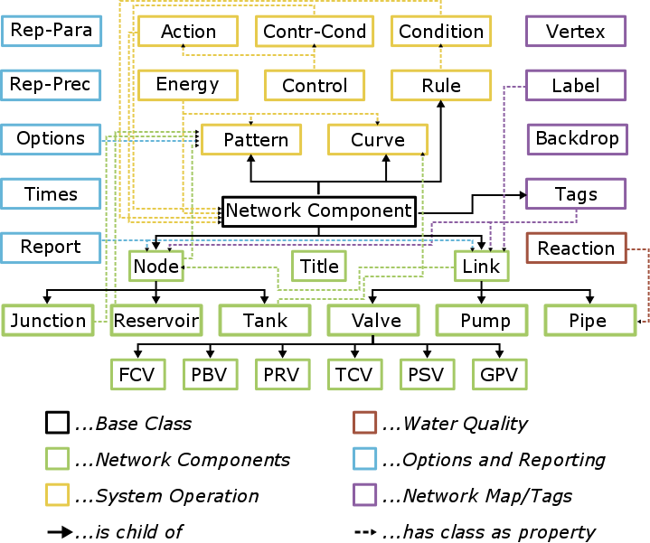

oopnet.elements package
=======================

This section describes the various classes that OOPNET provides for hydraulic models. The figure below shows the
classes and their relationships:

    Class structure of OOPNET

Submodules
----------

oopnet.elements.base module
---------------------------

.. automodule:: oopnet.elements.base
   :members:
   :undoc-members:
   :show-inheritance:

oopnet.elements.component\_registry module
------------------------------------------

.. automodule:: oopnet.elements.component_registry
   :members:
   :undoc-members:
   :show-inheritance:

oopnet.elements.network module
------------------------------

.. automodule:: oopnet.elements.network
   :members:
   :undoc-members:
   :show-inheritance:

oopnet.elements.network\_components module
------------------------------------------

.. automodule:: oopnet.elements.network_components
   :members:
   :undoc-members:
   :show-inheritance:

oopnet.elements.network\_map\_tags module
-----------------------------------------

.. automodule:: oopnet.elements.network_map_tags
   :members:
   :undoc-members:
   :show-inheritance:

oopnet.elements.options\_and\_reporting module
----------------------------------------------

.. automodule:: oopnet.elements.options_and_reporting
   :members:
   :undoc-members:
   :show-inheritance:

oopnet.elements.system\_operation module
----------------------------------------

.. automodule:: oopnet.elements.system_operation
   :members:
   :undoc-members:
   :show-inheritance:

oopnet.elements.water\_quality module
-------------------------------------

.. automodule:: oopnet.elements.water_quality
   :members:
   :undoc-members:
   :show-inheritance:

Module contents
---------------

.. automodule:: oopnet.elements
   :members:
   :undoc-members:
   :show-inheritance:
