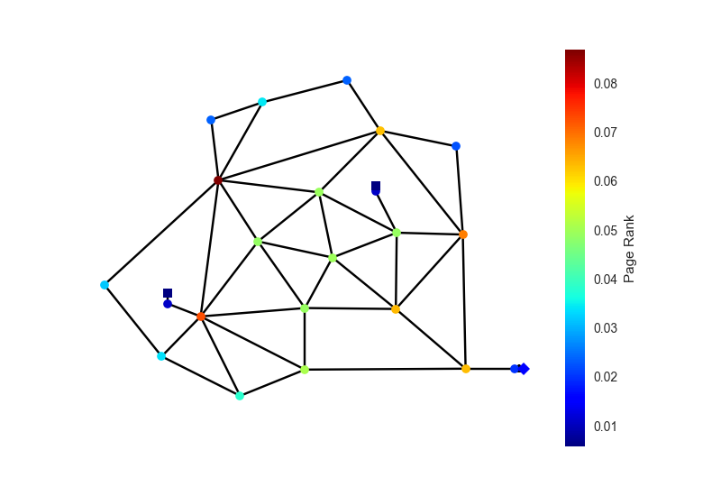

Graphs
======

OOPNET can be used together with the library :mod:`networkx` for graph theoretic use cases.

First, we import all dependencies and read the "Anytown" model. We need the following libraries:

- :mod:`os` is used for specifying file paths
- :mod:`networkx` provides graph theoretical functionalities
- :mod:`matplotlib.pyplot` is used for plotting
- :mod:`seaborn` is based on :mod:`matplotlib` and is also used for plotting

.. literalinclude:: /../examples/userguide_graphs.py
	:language: python
	:lines: 1-10

To use NetworkX, we have to create a graph object from our model. NetworkX supports different graph types:

- :class:`networkx.Graph`
- :class:`networkx.DiGraph`
- :class:`networkx.MultiGraph`
- :class:`networkx.MultiDiGraph`

Choose a graph type that is suitable for the analysis you want to do. OOPNET provides factories to convert a
:class:`~oopnet.elements.network.Network` to the classes listed above.

.. warning::
    :class:`networkx.Graph` and :class:`networkx.DiGraph` do not support multiple connections between two vertices!
    This means, that if you have several pipes in parallel connecting two junctions, only one of those pipes will be
    kept in graph. If you want to keep all connections, use :class:`networkx.MultiGraph` or
    :class:`networkx.MultiDiGraph` instead.

To convert a network into a graph object, use one of the factory classes available:

- :class:`~oopnet.graph.graph.Graph`
- :class:`~oopnet.graph.graph.DiGraph`
- :class:`~oopnet.graph.graph.MultiGraph`
- :class:`~oopnet.graph.graph.MultiDiGraph`

In this example, we create a :class:`networkx.MultiGraph` from our model:

.. literalinclude:: /../examples/userguide_graphs.py
	:language: python
	:lines: 12

The package NetworkX offers various possibilities like for example calculate different graph measurements like computing the graph theoretical `Center <https://en.wikipedia.org/wiki/Graph_center>`_, `Diameter <https://en.wikipedia.org/wiki/Distance_(graph_theory)>`_ or `Radius <https://en.wikipedia.org/wiki/Distance_(graph_theory)>`_ of the graph:

.. literalinclude:: /../examples/userguide_graphs.py
	:language: python
	:lines: 15

::

	Center: ['1', '4', '13', '19', '18']

.. literalinclude:: /../examples/userguide_graphs.py
	:language: python
	:lines: 16

::

	Diameter: 7

.. literalinclude:: /../examples/userguide_graphs.py
	:language: python
	:lines: 17

::

	Radius: 4

Now, we use Google's page rank algorithm on the network:

.. literalinclude:: /../examples/userguide_graphs.py
	:language: python
	:lines: 20

Let's create a :class:`pandas.Series` out of the results for better data handling. We then sort this series in descending order and give it a name. This name which will serve as a label for the color bar in OOPNET's network plot:

.. literalinclude:: /../examples/userguide_graphs.py
	:language: python
	:lines: 21-23

First, we plot the results as a bar plot:

.. literalinclude:: /../examples/userguide_graphs.py
	:language: python
	:lines: 26-27

We can also plot the page rank series directly on the network nodes with OOPNET's :meth:`~oopnet.elements.network.Network.plot` function:

.. literalinclude:: /../examples/userguide_graphs.py
	:language: python
	:lines: 30

We can also calculate the degree of every node in the network and save it as a :class:`pandas.Series`:

.. literalinclude:: /../examples/userguide_graphs.py
	:language: python
	:lines: 33-34

Of course, we can also plot this again as a bar plot:

.. literalinclude:: /../examples/userguide_graphs.py
	:language: python
	:lines: 36-39

.. image:: figures/examples/graph_degrees.png

We can calculate all shortest paths in the network, save them as a :class:`pandas.DataFrame` and plot them as a heatmap:

.. literalinclude:: /../examples/userguide_graphs.py
	:language: python
	:lines: 42-43,46-49

Further Examples
----------------

.. toctree::
   :maxdepth: 1

   examples.adjacency_matrix.rst
   examples.centrality.rst
   examples.graph_weight.rst

Summary
-------

.. literalinclude:: /../examples/userguide_graphs.py
	:language: python