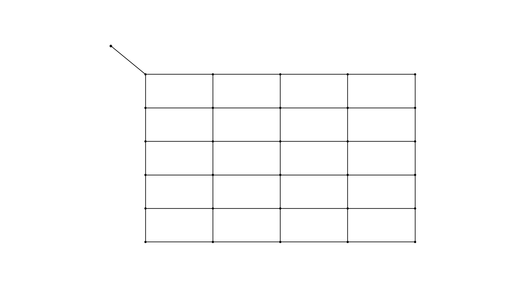
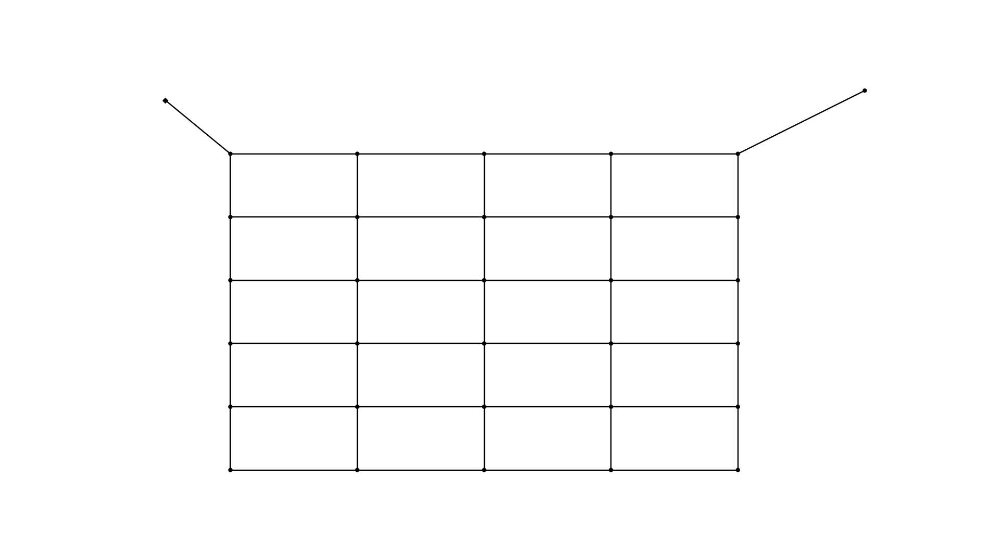
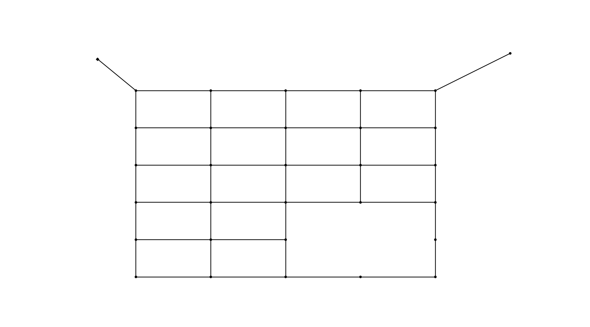

Network and Network Components
==============================

In OOPNET, everything is about the :class:`~oopnet.elements.network.Network` class. A network is the object-oriented representation of a
hydraulic water distribution system model. It contains all the information stored in a EPANET input file and can
be easily manipulated, accessed, simulated and plotted.

In this guide, we will take a look at the network class, the individual components stored in it and how to interact
with them.

Creating a Network
------------------

The network acts as a container for all network components, settings etc. that you can find in an EPANET model. You
can create a new, empty model:

.. literalinclude:: /../examples/userguide_network.py
    :language: python
    :lines: 3-5

Alternatively, you can read an EPANET input file and create a network from it. OOPNET supports both EPANET 2.0 and
2.2 models. For instance, we can read a saved model - in this example the model by Poulakis et al. - using the network's
:meth:`~oopnet.elements.Network.read` method. We recommend using the :mod:`os` library for specifying the file path:

.. literalinclude:: /../examples/userguide_network.py
    :language: python
    :lines: 1-3, 7-8

Writing an Input File
---------------------

Writing a network object to an EPANET input file is very easy. Just use the network's :meth:`~oopnet.elements.Network.write`
method:

.. literalinclude:: /../examples/userguide_network.py
    :language: python
    :lines: 10

Network Components
------------------

A network contains objects representing the different model components:

- :class:`~oopnet.elements.network_components.Node`
    - :class:`~oopnet.elements.network_components.Junction`
    - :class:`~oopnet.elements.network_components.Tank`
    - :class:`~oopnet.elements.network_components.Reservoir`
- :class:`~oopnet.elements.network_components.Link`
    - :class:`~oopnet.elements.network_components.Pipe`
    - :class:`~oopnet.elements.network_components.Pump`
    - :class:`~oopnet.elements.network_components.Valve` with dedicated subclass like
      :class:`~oopnet.elements.network_components.FCV` for the different valve types
- :class:`~oopnet.elements.system_operation.Pattern`
- :class:`~oopnet.elements.system_operation.Curve`
- :class:`~oopnet.elements.system_operation.Rule`
- :class:`~oopnet.elements.system_operation.Energy`

Getter Functions
~~~~~~~~~~~~~~~~

To access the individual components in the model, OOPNET provides utility functions like
:func:`~oopnet.utils.getters.get_by_id.get_junction` to get a single :class:`~oopnet.elements.network_components.Junction`
by its ID, while functions like :func:`~oopnet.utils.getters.element_lists.get_pumps` returns a list of all
:class:`~oopnet.elements.network_components.Pump` objects.
If you want a list of all IDs of objects of a certain type stored in a network, you can use functions like
:func:`~oopnet.utils.getters.element_lists.get_node_ids`. Take a look at :mod:`~oopnet.utils.getters` for a complete
list of all available getter functions.

As an example, we can iterate over all junctions in the network and print their demands and elevations in the console:

.. literalinclude:: /../examples/userguide_network.py
    :language: python
    :lines: 12-13

This results in an output like this:

::

    Junction(id='J-02', comment=None, tag=None, xcoordinate=500.0, ycoordinate=7500.0, elevation=0.0, initialquality=0.0, sourcequality=0.0, sourcetype=None, strength=0.0, sourcepattern=None, emittercoefficient=0.0, demandpattern=None, demand=50.0) 50.0 0.0
    Junction(id='J-03', comment=None, tag=None, xcoordinate=500.0, ycoordinate=7000.0, elevation=0.0, initialquality=0.0, sourcequality=0.0, sourcetype=None, strength=0.0, sourcepattern=None, emittercoefficient=0.0, demandpattern=None, demand=50.0) 50.0 0.0
    Junction(id='J-04', comment=None, tag=None, xcoordinate=500.0, ycoordinate=6500.0, elevation=0.0, initialquality=0.0, sourcequality=0.0, sourcetype=None, strength=0.0, sourcepattern=None, emittercoefficient=0.0, demandpattern=None, demand=50.0) 50.0 0.0
    Junction(id='J-05', comment=None, tag=None, xcoordinate=500.0, ycoordinate=6000.0, elevation=0.0, initialquality=0.0, sourcequality=0.0, sourcetype=None, strength=0.0, sourcepattern=None, emittercoefficient=0.0, demandpattern=None, demand=50.0) 50.0 0.0
    Junction(id='J-06', comment=None, tag=None, xcoordinate=500.0, ycoordinate=5500.0, elevation=0.0, initialquality=0.0, sourcequality=0.0, sourcetype=None, strength=0.0, sourcepattern=None, emittercoefficient=0.0, demandpattern=None, demand=50.0) 50.0 0.0
    Junction(id='J-07', comment=None, tag=None, xcoordinate=500.0, ycoordinate=5000.0, elevation=0.0, initialquality=0.0, sourcequality=0.0, sourcetype=None, strength=0.0, sourcepattern=None, emittercoefficient=0.0, demandpattern=None, demand=50.0) 50.0 0.0
    ...

Adding Components
~~~~~~~~~~~~~~~~~

If you want to add a new component, you can use the utility functions provided in :mod:`~oopnet.utils.adders`.
Here, we create a new junction and a new pipe to the system:

.. literalinclude:: /../examples/userguide_network.py
    :language: python
    :lines: 15-18

Removing Components
~~~~~~~~~~~~~~~~~~~

Now, we want to remove the junction with the ID ``J-24`` and all links connected to it. First, we get the junction
object and use another utility function, :func:`~oopnet.utils.getters.topology_getters.get_adjacent_links`, to get a
list of all links connected to the junction:

.. literalinclude:: /../examples/userguide_network.py
    :language: python
    :lines: 20-22

Now, we can make use of the removing functions in :mod:`~oopnet.utils.removers`. We first remove the links and then
the junction from the model:

.. literalinclude:: /../examples/userguide_network.py
    :language: python
    :lines: 24-27

Summary
-------

.. literalinclude:: /../examples/userguide_network.py
	:language: python