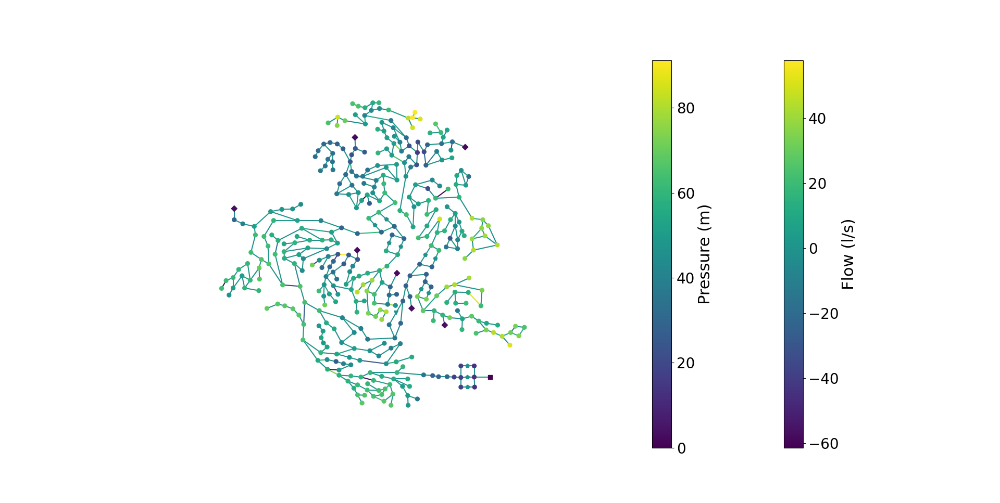
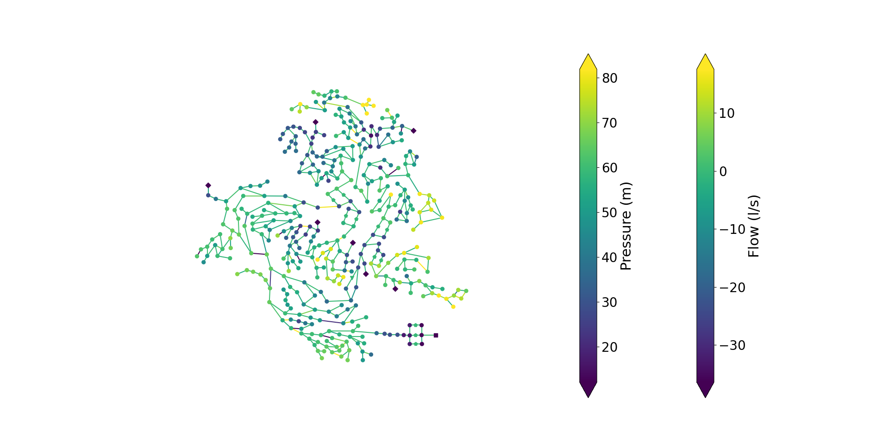
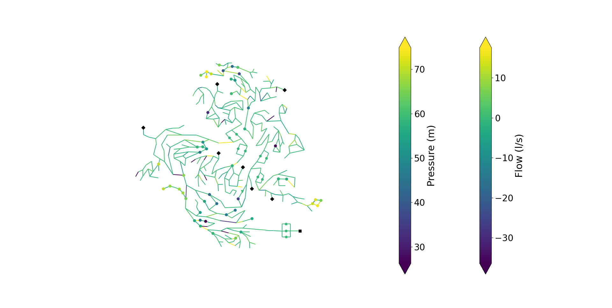

Plotting
========

Now, we will do some basic plots with OOPNET. OOPNET comes with several plotting options:

- static plotting based on :mod:`matplotlib`
- animations based on :mod:`matplotlib`
- interactive plots based on :mod:`bokeh`

First, we will create a static matplotlib plot.

`Matplotlib <http://matplotlib.org>`_
-------------------------------------

Static Plotting
^^^^^^^^^^^^^^^

First, we declare our imports and read the "C-Town" model:

.. literalinclude:: /../examples/userguide_plotting.py
	:language: python
	:lines: 1-8

We can now plot the model as-is:

.. literalinclude:: /../examples/userguide_plotting.py
	:language: python
	:lines: 10

We can also run a simulation and plot the pressure and flow (or any other :class:`pandas.Series` with link or node IDs
as index) by passing them to the ``nodes`` and ``links`` arguments.

.. literalinclude:: /../examples/userguide_plotting.py
	:language: python
	:lines: 12-16

There is also the possibility to limit the color bar to values between the 2nd and 98th percentile using the ``robust``
parameter. If it is set to ``True``,  the colors in the plot will be more finely graduated because the minima and maxima
values will not be used for the calculating the value range of the color bar.

.. literalinclude:: /../examples/userguide_plotting.py
	:language: python
	:lines: 17

But what if you don't want to plot all junctions? For instance, if you calculate the difference in pressure between
measurement and simulation data, you might not have a value to plot for every junction. By default, if a junction
doesn't have a value assigned, the junction will be plotted in black.

Alternatively, you can prevent OOPNET from plotting junctions without a value assigned and therefore simplify the
plot. In this example we only plot the first 50 pressure values from the report by reducing the pressure dataset and
passing the ``truncate_nodes`` argument to the plotting function:

.. literalinclude:: /../examples/userguide_plotting.py
	:language: python
	:lines: 19-20

You can also pass values for the link width in the plot. Here, we use this to show the diameters in the network while
hiding all the nodes.

.. literalinclude:: /../examples/userguide_plotting.py
	:language: python
	:lines: 22-23

Don't forget to show the plots:

.. literalinclude:: /../examples/userguide_plotting.py
	:language: python
	:lines: 25

Plotting Animations
^^^^^^^^^^^^^^^^^^^

In this example we want to create a matplotlib animation of the model where we plot the flow and pressure results from an
extended period simulation.

For this, we first have to import the packages we require:

- `os` for specifying the path to the EPANET input file
- `matplotlib.pyplot` for creating an animation of a certain size
- `matplotlib.animation.PillowWriter` for writing the animation to a file
- and of course `oopnet` itself

In this example we read a part of the `L-Town` network (Area C) with slight modifications. This model
already comes with included patterns and can be used for extended period simulations.

.. literalinclude:: /../examples/run_and_animate.py
	:language: python
	:lines: 1-9

Then, we can simulate the model with its ``.run()`` method and save the simulation results to the variable ``rpt``.

.. literalinclude:: /../examples/run_and_animate.py
	:language: python
	:lines: 11

If we want to take a closer look at the simulation results, we can access the report's different properties. Since we
want to use the flow and pressure data in the animation, we assign them to variables. We also limit the data to a single
day and take a look at a few data points.

.. literalinclude:: /../examples/run_and_animate.py
	:language: python
	:lines: 13-16

.. :meth:`oopnet.report.report_getter_functions`

Now, we create an animation using the Network's ``.animate()`` method. First, we create matplotlib `Figure` and `Axes`
objects and pass a desired figure size:

.. literalinclude:: /../examples/run_and_animate.py
	:language: python
	:lines: 18

We then pass the ``ax`` object to the ``animate`` method along with the simulation data. We call the flow data's
``.abs()`` method, to use the absolute flow values in the animation. The labels for the node and link color bars have
to be passed as well.
You can also specify how long the interval between the reporting time steps should be. The model uses a reporting time
step of 5 minutes, so we choose an interval of 50 ms. The ``robust`` argument limits the color bar to values between
the 2nd and the 98th percentile of the passed data's value range.

.. literalinclude:: /../examples/run_and_animate.py
	:language: python
	:lines: 19

.. image:: figures/examples/simple_animation.gif

Finally, we can save the animation. Using the ``dpi`` and ``fps`` attributes helps you control the animation quality
and file size:

.. literalinclude:: /../examples/run_and_animate.py
	:language: python
	:lines: 20

`Bokeh <https://bokeh.org/>`_
-------------------------------------

Now, we will create an interactive plot using :mod:`bokeh`. Let's start with our imports and model reading (we will
use the "C-Town" model once again):

.. literalinclude:: /../examples/bokeh_run_and_plot.py
	:language: python
	:lines: 1-7

Next, we simulate the model and get the pressure and flow results for our plot:

.. literalinclude:: /../examples/bokeh_run_and_plot.py
	:language: python
	:lines: 9-11

Bokeh creates the plot in a HTML file that will be locally stored on your device. We can set the file name using
:func:`bokeh.plotting.output_file`:

.. literalinclude:: /../examples/bokeh_run_and_plot.py
	:language: python
	:lines: 13

Finally, we create and show the plot:

.. literalinclude:: /../examples/bokeh_run_and_plot.py
	:language: python
	:lines: 14-15

.. bokeh-plot:: bokehplot_userguide.py
    :source-position: None

Summary
-------

Static Matplotlib Plotting
^^^^^^^^^^^^^^^^^^^^^^^^^^

.. literalinclude:: /../examples/userguide_plotting.py
	:language: python

Animated Matplotlib Plotting
^^^^^^^^^^^^^^^^^^^^^^^^^^^^

.. literalinclude:: /../examples/run_and_animate.py
	:language: python

Interactive Bokeh Plot
^^^^^^^^^^^^^^^^^^^^^^

.. literalinclude:: /../examples/bokeh_run_and_plot.py
	:language: python